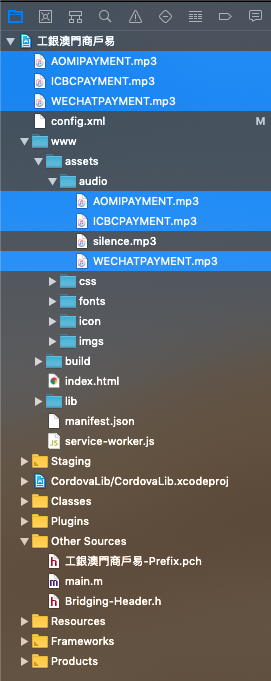

# ReadMe
## code-push deploy
- Staging

  ```shell
  $ ionic cordova prepare ios
  $ code-push release-cordova CardMerchant_ios ios
  ```

- Production

  ```shell
  $ npm run ionic:ios:prepare
  $ npm run ionic:ios:release
  ```

  *replace 'ios' with 'android' to deploy the android version*

## iOS custom notification sound

1. ```ionic cordova prepare ios```
2. open **platforms/ios/工銀澳門商戶易.xcworkspace**
3. drag the .mp3 files from **www/assets/audio** to the project root directory
   
4. uncheck "Copy items if need"
   